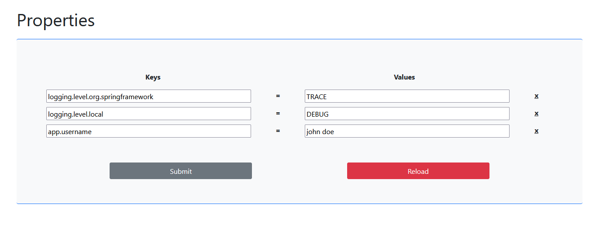

# Properties Admin Web
### _This app is a nice and user-friendly way to manage application properties file of the active profile._

> ### How it looks like:
> 
>

 ### External libraries used
> ### Backend:
> - #### spring-boot-starter-parent:2.7.5
> - #### spring-boot-starter-web:2.7.5
> - #### spring-boot-starter-thymeleaf:2.7.5
> - #### lombok:1.18.24
> - #### lombok:1.18.24
> 
> ### Frontend:
> - #### bootstrap:5.0.2

> ### What else?
> _obviously_:
> - #### html:5
> - #### javascript:1.5

